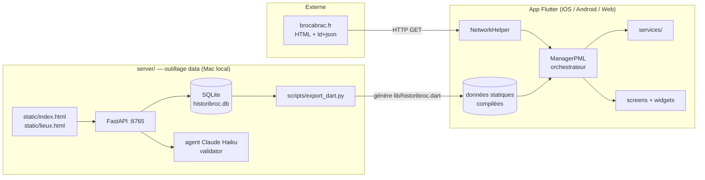
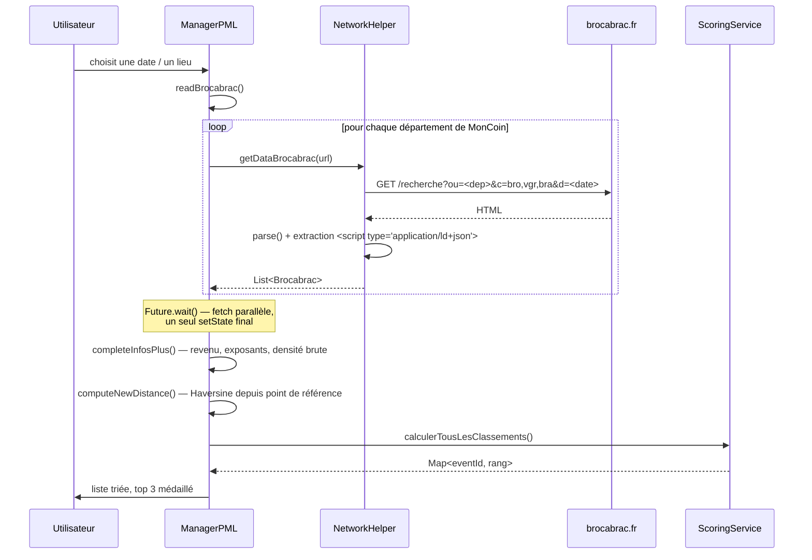
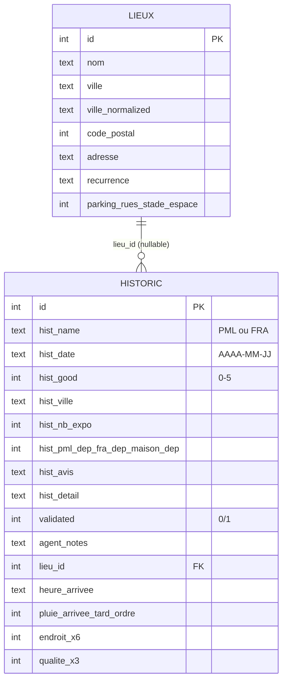

# Architecture logicielle — cobroc

<!-- Dernière mise à jour : 2026-07-20 -->

Document de référence sur la structure du monorepo **cobroc** : l'application
Flutter (`lib/`) et l'outillage données Python (`server/`).

---

## 1. Vue d'ensemble

cobroc aide à choisir quelles brocantes visiter le week-end. L'app récupère les
événements publiés sur `brocabrac.fr`, les enrichit avec des données statiques
(revenu des communes, historique des visites passées), calcule un **score
pondéré**, puis affiche un classement trié par distance.

Deux sous-systèmes, couplés uniquement par un **fichier Dart généré** :



**Point clé** : l'app ne parle **jamais** au serveur au runtime. Le serveur est
un outil de saisie hors-ligne dont le seul livrable vers l'app est le fichier
`lib/historibroc.dart` régénéré au build. L'app est donc 100 % autonome et
fonctionne sans réseau autre que brocabrac.fr.

---

## 2. Application Flutter

### 2.1 Couches

| Couche | Emplacement | Rôle |
|---|---|---|
| Entrée | `lib/main.dart` | `MyApp` → `MaterialApp` → `ManagerPML` |
| Orchestration | `lib/managerpml.dart` | Écran principal, état global de fait |
| Réseau / parsing | `lib/networking.dart` | Scraping brocabrac.fr |
| Domaine | `lib/services/` | Calculs purs, sans dépendance UI |
| Modèles | `lib/pmltools.dart`, `lib/models/` | Structures de données |
| Présentation | `lib/widgets/`, écrans `lib/*.dart` | Rendu |
| Données statiques | `lib/historibroc.dart`, `communestchinos.dart`, `villes_france.dart` | Listes compilées dans le binaire |

### 2.2 Gestion d'état

**`setState` + `SharedPreferences`.** Pas de Riverpod, Bloc ou Provider.
`_ManagerPMLState` détient la totalité de l'état applicatif (~80 champs) :
liste des brocantes, coordonnées de référence, poids de scoring, départements
sélectionnés, mode GPS simulé. Les widgets enfants reçoivent des données et des
callbacks par constructeur — pas d'`InheritedWidget`.

La persistance passe exclusivement par `StorageService` (façade sur
`SharedPreferences`), qui expose un objet immuable `AppParameters`
(`copyWith`) pour les réglages de scoring, plus des accesseurs dédiés pour
`lieuActuel`, `MonCoin` (liste de départements) et le GPS simulé.

> Contrainte projet : **ne pas migrer vers une lib d'état** de sa propre
> initiative (cf. `CLAUDE.md`).

### 2.3 Flux de données principal



Étapes détaillées :

1. **Construction des URLs** — `ManagerPML` compose
   `https://brocabrac.fr/recherche?ou=<dept>&c=bro,vgr,bra&d=<date>` pour chaque
   code département de la liste active `MonCoin`.
2. **Fetch parallèle** — `Future.wait()` sur tous les départements, puis un
   **seul** `setState` à la fin (évite N rebuilds).
3. **Parsing** — `NetworkHelper` parse le HTML avec le package `html`, extrait
   tous les blocs `application/ld+json` de type `Event` (schema.org), et
   récupère en parallèle les tranches d'exposants via les éléments de classe
   `dots` (attribut `title`). L'`eventId` est reconstruit depuis le `href` du
   lien frère.
4. **Enrichissement** (`completeInfosPlus`) — pour chaque brocante :
   - `revenu` via un index `Map<ville, Commune>` construit sur `listCommunes`,
     converti en note `brocStarRevenu` (0→5, seuils 10/15/20/25/30 k€) ;
   - `brocStarNbExposants` : la tranche textuelle brocabrac
     (« De 100 à 200 ») est convertie en valeur pivot numérique (150) ;
   - `brocDejaVu` : `""` si la ville est dans `listHistoric`, `"New"` sinon.
5. **Distances** — `GeoService.distanceInKmBetweenEarthCoordinates` (Haversine)
   depuis `latitudeRef/longitudeRef` (`brocFromCenter`) et depuis le point
   sélectionné sur la carte (`brocFromSelect`).
6. **Scoring et tri** — voir §2.5.

**Complexité** : l'enrichissement densité est en O(N²) sur le nombre de
brocantes du jour (typiquement quelques centaines) ; il est volontairement
exécuté **une seule fois** après tous les fetches.

### 2.4 Modèles

**`Brocabrac`** (`pmltools.dart`) — le modèle central, mutable, ~25 champs :

| Groupe | Champs |
|---|---|
| Identité | `eventId`, `brocName`, `brocType`, `brocOrganizer` |
| Lieu | `brocLocality`, `brocPostal`, `brocStreet`, `brocVenueName`, `brocLatitude`, `brocLongitude` |
| Temps | `brocStartDate`, `brocEndDate` |
| Statut | `brocEventStatus` (`OK` / `KO` si `cancelled`) |
| Enrichi | `brocNbExposants` (texte), `brocStarNbExposants` (pivot), `brocStarRevenu`, `brocStarBarycentre` (densité), `brocDejaVu` |
| Calculé | `brocFromCenter`, `brocFromSelect`, `brocMaster` (rang), `brocInside`, `revenu` |

Classes auxiliaires : **`ManageCobrac`** (wrapper d'arguments de navigation :
liste complète + élément sélectionné) et **`GoToMarket`** (données de trajet
carte : marqueurs + centre).

**`Historic`** (`historibroc.dart`) — généré par `export_dart.py`, ~2 232
entrées validées. Champs de base (`histName`, `histDate`, `histGood`,
`histVille`, `histNbExpo`, dépenses, `histAvis`, `histDetail`) plus des champs
enrichis en **paramètres nommés optionnels** (`heureArrivee`, `pluie`,
`arriveeTard`, `parking`, `rues`, `stade`, `espace`) — émis uniquement s'ils
sont non-défaut, ce qui garantit la rétro-compatibilité des anciennes lignes.

### 2.5 Scoring — `ScoringService`

Quatre critères pondérés, chacun noté /5, plus un facteur distance optionnel :

```
scoreBase   = exposants·Pe/100 + densité·Pd/100 + revenu·Pr/100 + historique·Ph/100
scoreFinal  = inclureDistance ? scoreBase · (0.8 + scoreDistance/5 · 0.2) : scoreBase
note        = clamp(scoreFinal/5 · 98 + 1, 1, 99)
```

| Critère | Barème |
|---|---|
| Exposants | ≥300 → 5 ; ≥250 → 4 ; ≥150 → 3 ; ≥75 → 2 ; ≥25 → 1 ; sinon 0.5 |
| Densité pondérée | moyenne des scores exposants des voisins dans `rayonDensite`, pondérée par `(rayon−d)/rayon`, ignorant les voisins à moins de 1 km |
| Revenu | note 0–5 dérivée du revenu médian de la commune |
| Historique | 3.5 si déjà visitée, 2.5 sinon |
| Distance | ≤10 km → 5 ; ≤20 → 4 ; ≤40 → 3 ; ≤60 → 2 ; ≤100 → 1 ; sinon 0.5 |

Les poids (`poidExposants` 30, `poidDensite` 25, `poidRevenu` 20,
`poidHistorique` 25 par défaut) sont réglables via `RayonDialog` et persistés.
Une brocante annulée (`brocEventStatus != 'OK'`) est court-circuitée à 0.

`calculerTousLesClassements()` renvoie une `Map<eventId, rang>` ; le top 3 est
médaillé 🥇🥈🥉 dans la liste, les annulées sont affichées en rouge écarlate
`#D50000` avec préfixe `KO`.

### 2.6 Services

| Service | Type | Responsabilité |
|---|---|---|
| `GeoService` | statique | Haversine ; comptage de brocantes dans un rayon |
| `ScoringService` | instancié (poids injectés) | Score, densité pondérée, classements, top 10 |
| `FilterService` | statique | Filtre par catégorie d'exposants / historique seul |
| `DateService` | statique | Prochain samedi/dimanche, navigation, formatage `intl` |
| `HolidayService` | statique | Calcul de Pâques (algorithme de Gauss) + fêtes fixes ; navigation intra/inter-semaine sur les jours « brocantables » (sam/dim/férié) |
| `LocationService` | instancié | GPS `geolocator` + reverse geocode `geocoding` → département ; table des départements limitrophes |
| `StorageService` | statique | `SharedPreferences` (clés suffixées `_cobrac`) |

Les services de calcul sont **purs et testables** : aucun import Flutter, aucun
accès à l'état de l'écran (l'appartenance à l'historique est injectée sous forme
de callback `bool Function(String)`).

### 2.7 Écrans et widgets

| Fichier | Écran |
|---|---|
| `managerpml.dart` | Liste principale, double panneau, orchestration (1 633 lignes) |
| `detailedBrocante.dart` | Détail d'une brocante (appui long) + analyse historique |
| `monplan.dart` | Carte interactive `flutter_map` + tuiles OSM |
| `departements.dart` | Sélecteur de départements (`interactive_country_map`) |
| `datate.dart` | Sélecteur de date (`ConfigBrocante`) |
| `histeric.dart` | Consultation / recherche dans l'historique |

| Widget | Rôle |
|---|---|
| `BrocanteListView` | Panneau gauche — liste complète triée par `brocFromCenter` |
| `BrocanteListReduce` | Panneau droit — liste filtrée triée par `brocFromSelect` |
| `RayonDialog` | Réglages rayon de densité + poids de scoring |

### 2.8 Positionnement

Trois lieux de référence codés en dur (Larris, Portbail, Loon-Plage) plus un
mode GPS. Le lieu actif détermine à la fois les départements interrogés et les
coordonnées de référence pour les distances.

Le **GPS simulé** permet de tester une position arbitraire : pad 2D
`GestureDetector` + `CustomPaint` (`_FrancePainter`, silhouette en 57 points),
bornes lat 42.3–51.1°N / lon −4.8–8.2°E, boutons ±0.1° pour l'ajustement fin.
Les 5 villes les plus proches (issues de `listVillesFrance`, 9 911 communes ≥
1 000 hab.) se recalculent en temps réel pendant le glissement. L'activation ne
modifie **pas** les départements sélectionnés — seulement les coordonnées.

### 2.9 Données statiques compilées

| Fichier | Contenu | Taille |
|---|---|---|
| `communestchinos.dart` | `listCommunes` — communes + revenu, population, coordonnées | ~17 200 lignes |
| `villes_france.dart` | `listVillesFrance` — 9 911 communes ≥ 1 000 hab. | ~9 900 lignes |
| `historibroc.dart` | `listHistoric` — 2 232 visites validées (**généré**) | ~2 300 lignes |

Ces listes sont embarquées dans le binaire → fonctionnement offline, mais
augmentent la taille de l'app et le temps de compilation. **Ne pas les
reformater ni les réordonner massivement** (diffs illisibles).

### 2.10 Dépendances

| Package | Usage |
|---|---|
| `http` | Requêtes vers brocabrac.fr |
| `html` | Parsing HTML, extraction ld+json |
| `flutter_map` + `latlong2` | Cartes OSM |
| `google_maps_flutter` | Marqueurs (type `Marker` utilisé par `GoToMarket`) |
| `interactive_country_map` | Sélecteur de départements |
| `geolocator` + `geocoding` | GPS + reverse geocode |
| `shared_preferences` | Persistance des réglages |
| `diacritic` | Comparaison insensible aux accents |
| `intl` | Formatage des dates |

---

## 3. Sous-système `server/`

Ex-repo `cobroc-server`, intégré par `git subtree`. Serveur REST local
(réseau domestique uniquement) pour saisir et corriger l'historique des visites.

### 3.1 Stack

Python 3.11 (venv `.venv/`), FastAPI + Uvicorn, SQLite, agent Claude Haiku.
Tourne en service **launchd** (`com.pml.cobroc-server.plist`) sur
`0.0.0.0:8765` ; Swagger sur `/docs`.

### 3.2 Schéma de données



Séparation **lieu** (entité stable, réutilisable) / **visite** (événement daté).
Les caractéristiques `endroit_*` sont stockées sur la visite ; les champs
`parking/rues/stade/espace` de `lieux` décrivent le lieu lui-même. Index sur
`hist_ville`, `hist_date`, `hist_name`, `validated`, `lieu_id`,
`lieux.ville_normalized`. Collation `NOACCENT` pour les recherches.

Les migrations sont **idempotentes** : `_migrate_db()` s'exécute au startup,
détecte les colonnes manquantes via `PRAGMA table_info` et les ajoute avec leur
défaut.

### 3.3 API

| Ressource | Routes |
|---|---|
| Lieux | `GET/POST /lieux`, `GET/PUT/DELETE /lieux/{id}` |
| Visites | `GET/POST /historic`, `GET/PUT/DELETE /historic/{id}` |
| Outils | `GET /export/dart`, `GET /stats` |

Filtres : `ville` (préfixe, sans accents, insensible à la casse), `cp`, `name`,
`validated`, `year`, `sort`, `limit`, `offset`. `DELETE /lieux/{id}` est refusé
si le lieu est référencé par une visite.

### 3.4 Agent de validation

Chaque `POST` / `PUT` sur `/historic` passe par `agent/validator.py` (Claude
Haiku) qui vérifie le format de date, la cohérence ville/code postal, détecte
les doublons potentiels, et retourne `{approved, notes, suggestions}`.

Garde-fous : les suggestions sur les champs entiers ne sont appliquées que si
parsables en `int` ; les **champs libres** (`hist_avis`, `hist_detail`,
`hist_adresse`) ne sont **jamais** modifiés — verrouillage à la fois dans le
prompt système et côté serveur (`NO_SUGGEST`).

### 3.5 Interfaces web

Deux pages HTML/CSS/JS autonomes, sans build : `static/index.html` (saisie
d'une visite) et `static/lieux.html` (gestion des lieux). Le champ Ville de la
saisie est un **pur sélecteur** sur `/lieux` — `lieu_id` obligatoire, la
création d'un lieu passe forcément par `lieux.html`.

### 3.6 Pipeline de données

```
saisie web → POST /historic → validator (Haiku) → SQLite (validated=0|1)
                                                        │
                                    export_dart.py (WHERE validated = 1)
                                                        ↓
                                            lib/historibroc.dart
                                                        ↓
                                        flutter build (données bundlées)
```

La base SQLite est la **source de vérité** et est versionnée (seuls les
`*.backup-*.db` sont gitignorés). Modifier la base ne change rien dans l'app
tant que `export_dart.py` n'a pas été relancé **et** l'app rebuildée.

```bash
cd server
python3 scripts/export_dart.py     # écrit ../lib/historibroc.dart
cd .. && dart analyze lib/historibroc.dart
flutter build ios                  # ou apk / web
```

Le template de la classe `Historic` vit **dans** `export_dart.py` : toute
modification du modèle Dart doit y être répercutée, sinon la régénération
suivante casse la compilation (`export_dart.py` écrase le fichier).

---

## 4. Conventions

- **En-tête obligatoire** sur tout fichier `.dart` créé ou modifié : chemin
  réel, `Modified: YYMMDDHHMMM`, titre, liste numérotée des changements avec
  les lignes concernées.
- **Imports absolus** (`package:cobroc/...`), jamais de chemins relatifs.
- Commentaires en français ; termes techniques IA/ML en anglais non traduits
  (tool-calling, prompt, token, embedding, inference, structured output, RAG).
- `dart format` + `flutter analyze` sans warning avant de présenter un diff.
- Orthographe du projet : **cobroc** (jamais « cobrac »). Attention : les clés
  `SharedPreferences` historiques utilisent le suffixe `_cobrac` — les changer
  casserait la persistance existante.
- L'en-tête Dart ne s'applique pas aux fichiers Python de `server/`, qui ont
  leur propre convention (docstring d'en-tête).

---

## 5. Contraintes et risques

### Bloquant publication — statut juridique des données

cobroc scrape `brocabrac.fr`. La publication est **suspendue** tant que les
questions de droits ne sont pas tranchées (droit *sui generis* sur les bases de
données, CGU du site). En conséquence : ne pas rendre le scraping plus agressif
(fréquence, parallélisme au-delà de l'existant, contournement de protections,
`robots.txt`), ne pas pousser vers une mise en production, signaler tout
changement aggravant l'exposition juridique.

### Fragilité du scraping

`NetworkHelper` dépend de deux détails d'implémentation de brocabrac.fr : les
blocs `ld+json` de type `Event` et les éléments de classe `dots` porteurs de
l'attribut `title`. Un changement de markup côté site casse silencieusement
l'extraction (les erreurs sont capturées et renvoient une liste vide).

L'appariement entre exposants et événements repose sur un **index positionnel**
(`countBroc`) : si le nombre de blocs `dots` diverge du nombre d'événements, les
tranches d'exposants sont décalées.

### Secrets

Aucune clé en clair dans le dépôt. `server/.env` (clé API Anthropic) est
gitignoré.

---

## 6. Dette technique identifiée

| Point | Détail |
|---|---|
| `managerpml.dart` — 1 633 lignes | God object : état, orchestration réseau, calculs géo, dialogs et `CustomPainter` dans un seul fichier. Candidat naturel au découpage (le pad GPS `_FrancePainter` et les dialogs pourraient sortir dans `widgets/`). |
| Fichiers vides | `lib/models/config_lieu.dart` et `lib/widgets/brocante/filtre_exposants_dialog.dart` font 0 ligne — le dialog de filtre est en réalité inline dans `managerpml.dart` (`_showFiltreExposantsDialog`). |
| `mapcobrac.dart` orphelin | 314 lignes, importé par aucun fichier. Code mort ou écran en attente de branchement. |
| `zee.dart` documenté mais absent | `CLAUDE.md` décrit un écran `zee.dart` / `DetailBroc` / `analyzeBrocante` qui n'existe plus dans `lib/`. La documentation est en avance ou en retard sur le code. |
| Dépendances déclarées non utilisées | `sqlite3`, `analyzer 5.0.0`, `dart_ipify`, `clipboard` — `analyzer` épinglé en 5.0.0 contraint inutilement la résolution. |
| `noAccent()` incomplet | La méthode de `Brocabrac` ne traite que E/O ; les A, I, U accentués passent au travers, alors que `diacritic` est déjà une dépendance du projet. |
| Duplication du calcul de densité | `completeInfosPlus`/`computeDense` (dans `ManagerPML`) et `calculerDensitePonderee` (dans `ScoringService`) recalculent des voisinages proches avec des règles différentes. |
| Historique git écrasé | Un seul commit (« Initial commit — historique effacé ») : pas de `git bisect` ni d'archéologie possible. |
| Coordonnées et lieux en dur | Les trois lieux de référence et leurs départements sont des littéraux dans `ManagerPML` alors qu'un modèle `ConfigLieu` était prévu (fichier vide). |
